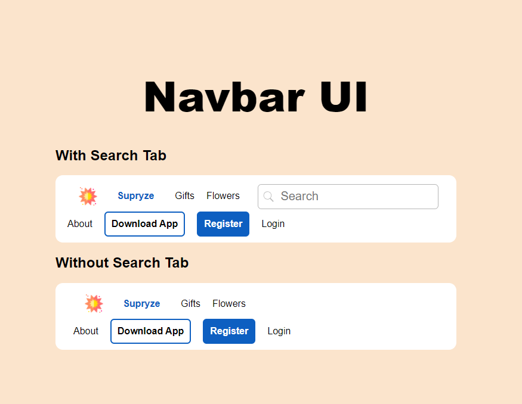

# Navbar UI

Este proyecto presenta dos versiones de una barra de navegación (navbar) en HTML y CSS. La primera versión incluye una barra de búsqueda, mientras que la segunda no la tiene. El diseño es responsivo y se adapta a diferentes tamaños de pantalla.

## Descripción

El proyecto incluye:

1. **Navbar con Barra de Búsqueda:**
   - Un logo.
   - Enlaces de navegación (Gifts, Flowers, About, Download App, Register, Login).
   - Una barra de búsqueda con un botón de búsqueda.

2. **Navbar sin Barra de Búsqueda:**
   - Un logo.
   - Enlaces de navegación (Gifts, Flowers, About, Download App, Register, Login).

El diseño utiliza variables CSS para gestionar tamaños de fuentes y otros elementos, y contiene estilos específicos para diferentes tamaños de pantalla para asegurar que el navbar se vea bien en dispositivos móviles, tabletas y pantallas grandes.

## Inspiración

Este proyecto fue inspirado por un diseño en Dribbble que intenté replicar:
[Navbar UI - Figma Auto Layout](https://dribbble.com/shots/18482616-Navbar-UI-Figma-Auto-Layout)

## Instrucciones para Visualizar el Proyecto

1. Clona el repositorio y abre el archivo `index.html` en tu navegador preferido.
  
2. Alternativamente, puedes ver el proyecto desplegado en GitHub Pages:
   - [Ver despliegue](https://eriksalva.github.io/navbar-UI-Figma-Auto-Layout/)

## Capturas de Pantalla

#### Pantalla Grande (1920px)

#### Pantalla Mediana (1440px)

#### Pantalla Mediana (1280px)

#### Pantalla Mediana (1024px)

#### Pantalla Pequeña (768px)

#### Pantalla Pequeña (480px)

---
